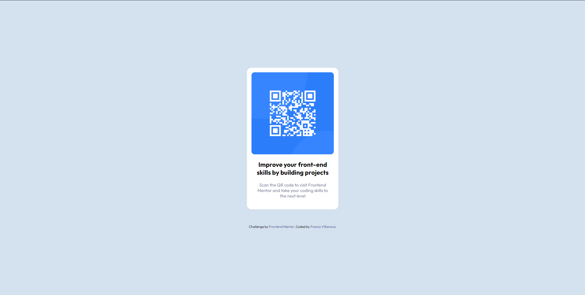

# Frontend Mentor - QR code component solution

This is a solution to the [QR code component challenge on Frontend Mentor](https://www.frontendmentor.io/challenges/qr-code-component-iux_sIO_H). Frontend Mentor challenges help you improve your coding skills by building realistic projects.

## Table of contents

- [Screenshot](#screenshot)
- [Links](#links)
- [Built with](#built-with)
- [Continued development](#continued-development)
- [Useful resources](#useful-resources)
- [Author](#author)

### Screenshot

### Links

- Solution URL: [Code](https://your-solution-url.com)
- Live Site URL: [Live site](https://your-live-site-url.com)

### Built with

- Semantic HTML5 markup
- CSS custom properties
- Flexbox

### Continued development

As to as CSS, i'm constantly trying to improve my semantic and making my code the most user-friendly i can.

### Useful resources

- [Color picker](https://imagecolorpicker.com/) - This helped to pick the colours of the picture provided.
- [Google Fonts](https://fonts.google.com/) - Here is where i picked the font of the document.

## Author

- Website - [Franco Villanova](https://portfolio-francovillanova-v1.vercel.app/)
- Frontend Mentor - [@Flein890](https://www.frontendmentor.io/profile/Flein890)
